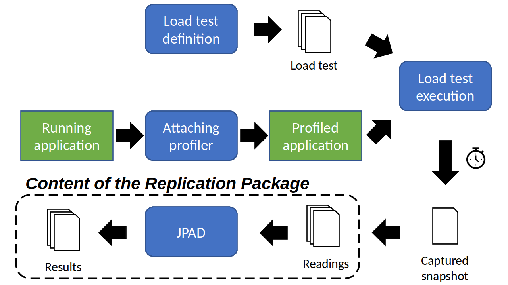

# Replication Package: Automated Detection of Software Performance Antipatterns in Java-based Applications

This is a replication package for the paper titled "Automated Detection of Software Performance Antipatterns in Java-based Applications" published in IEEE Transactions on Software Engineering.

## Authors
Catia Trubiani - Gran Sasso Science Institute (Italy) Riccardo Pinciroli - Gran Sasso Science Institute (Italy) Andrea Biaggi - University of Milan-Bicocca (Italy) Francesca Arcelli Fontana - University of Milan-Bicocca (Italy)

## Abstract
The detection of performance issues in Java-based applications is not trivial since many factors concur to poor performance, and software engineers are not sufficiently supported for this task. The goal of this manuscript is the automated detection of performance problems in running systems to guarantee that no quality-based hinders prevent their successful usage. Starting from software performance antipatterns, i.e., bad practices (e.g., extensive interaction between software methods) expressing both the problem and the solution with the purpose of identifying shortcomings and promptly fixing them, we develop a framework that automatically detects seven software antipatterns capturing a variety of performance issues in Java-based applications. Our approach is applied to real-world case studies from different domains, and it captures four real-life performance issues of Hadoop and Cassandra that were not predicted by state-of-the-approaches. As empirical evidence, we calculate the accuracy of the proposed detection rules, we show that code commits inducing and fixing real-life performance issues present interesting variations in the number of detected antipatterns instances, and solving one of the detected antipatterns improves the system performance up to 50%.

The content of this replication package refers to the dashed rectangle reported in the high-level workflow of our approach.

## Available Files
- <tt>JPAD-0.0.1.jar</tt> is the tool developed for this paper. See [Run JPAD](#run-jpad) for instructions on how to run JPAD.
- <tt>JPAD-0.0.1-cli.jar</tt> is the command line version of this tool.
- <tt>runParallelJPAD.py</tt> runs parallel system configurations using the command line version of JPAD
- *reading_files.tar.xz* contains all the reading files and usage statistics obtained by profiling the five Java applications using [YourKit Java Profiler](https://www.yourkit.com/java/profiler/). Due to its large size, this archive is split into multiple files that are placed in the <tt>reading\_files\_parts</tt> directory. Run <tt>join\_reading\_files.sh</tt> to generate the <tt>reading\_files.tar.xz</tt> archive. After extracting the files, five folders are available: <tt>original/</tt> contains the data profiled from original systems (i.e., CloudStore, TeaStore, WebGoat, TrainTicket, and OpenMRS), <tt>refactored/</tt> contains the reading files of refactored systems (i.e., OpenMRS), and <tt>comparison/</tt> contains the reading files of Hadoop and Cassandra.
- From <tt>original/</tt> and <tt>refactored/</tt> folders, reading files can be retrieved at <tt>\<clients\>-\<duration\>/\<system\>/</tt>, where <tt>\<clients\></tt>=(25, 50, 75, 100), <tt>\<duration\></tt>=(3, 6, 12), and <tt>\<system\></tt>=(cloudstore, teastore, webgoat, trainticket, openmrs). Available files are:
	- <tt>Call-tree---All-threads-merged.xml</tt> shows a top-down call tree of all application threads merged together into a single tree.
	- <tt>Call-tree---By-thread.xml</tt> shows an individual top-down call tree for each application thread.
	- <tt>Chart--CPU-Usage.csv</tt> measures the percentage of CPU used during the execution of the application.
	- <tt>Chart--Heap-Memory.csv</tt> measures the percentage of memory used during the execution of the application.
	- <tt>CPU-hot-spots.xml</tt> collects methods which spend the longest time on the CPU.
	- <tt>Method-list--allocations.csv</tt>
	- <tt>Method-list--CPU.csv</tt>
	- <tt>Method-list--garbage-collection.csv</tt>
	- <tt>Monitor-usage-statistics.xml</tt>
- The <tt>comparison/</tt> folder contains same reading files (alredy described at the previous point) for Hadoop and Cassandra. These reading files can be retrieved at <tt>\<system\>/\<clients\>-\<duration\>/\<commit\>/</tt>, where <tt>\<system\></tt>=(cassandra, hadoop), <tt>\<clients\></tt>=(1, 10, 100, 500, 1000), <tt>\<duration\></tt>=(3, 6, 12), <tt>\<commit\></tt>=(88d2ac4, f93e6e3) for Cassandra and <tt>\<commit\></tt>=(7af5d6b, 308d63f, 528b809, 738d1a2, decf8a6, e914220, ff8378) for Hadoop.
- From <tt>original/</tt>, <tt>refactored/</tt>, <tt>comparison/cassandra</tt>, and <tt>comparison/hadoop</tt> folders it is possible to run the <tt>checkProfilingLength.py</tt> script which prints the profiling time of each configuration.
- The <tt>accuracy/</tt> folder contains five files:
	- <tt>conf\_mats/</tt> contains the LaTeX code to print Table 8 and the confusion matrix of other performance antipatterns.
	- <tt>data/accuracy.csv</tt> (to be extracted from <tt>data/accuracy.zip</tt>) contains data to compute the accuracy of JPAD.
	- <tt>hotspots/</tt> contains the data to build the ground truth and used to compute the accuracy of JPAD.
	- <tt>acc_table.tex</tt> is the LaTeX code to print Table 9.
	- <tt>algorithm_accuracy.ipynb</tt> is an iPython Notebook that prints a LaTeX table reporting about the accuracy, precision, recall, and F1-score of the five applications (i.e., CloudStore, TeaStore, WebGoat, TrainTicket, OpenMRS). This iPython Notebook allows also generating the confusion matrix of all performance antipatterns analyzed in the paper.
- The <tt>analysis/</tt> folder contains three files:
	- <tt>original.csv</tt> provides results obtained by running JPAD with the original systems (i.e., CloudStore, TeaStore, WebGoat, TrainTicket, OpenMRS)
	- <tt>refactored.csv</tt> provides results obtained by running JPAD with the refactored systems (i.e., OpenMRS)
	- <tt>analysis.ipynb</tt> is an iPython Notebook that allows analyzing the two CSV files contained in this directory and generating some figures.

## Prerequisites
- [JDK 11 (or later)](https://www.oracle.com/java/technologies/javase-jdk11-downloads.html)

## Run JPAD
1) Start JPAD double-clicking on the <tt>JPAD-0.0.1.jar</tt> file or using the command: <tt>java -jar JPAD-0.0.1.jar</tt>.
2) Use the first file picker to select a <tt>CPU-hot-spots.xml</tt>.
3) Use the second file picker to select all the remaining reading files.
4) Choose which software performance antipatterns must be detected and provide the required thresholds. Note that all threshold values are mandatory when the respective antipattern is selected.
5) Press the <tt>Start Analysis</tt> button.

## Supported By:

